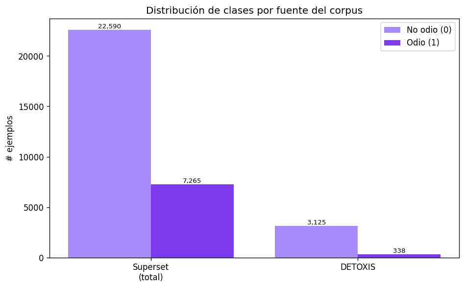
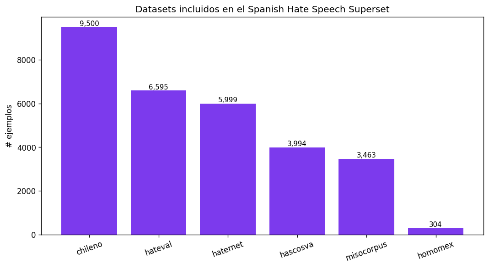
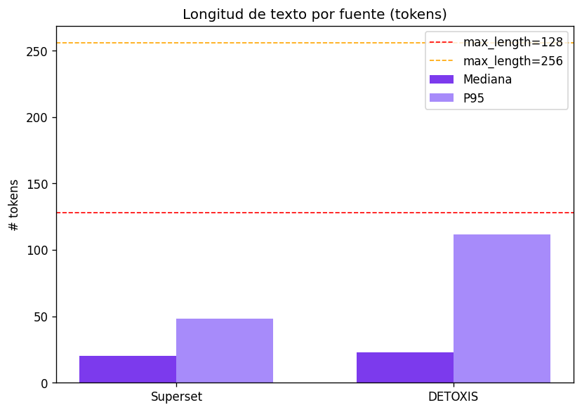
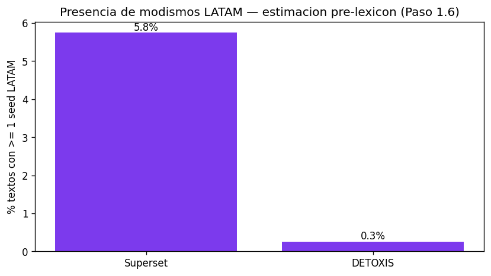

# Reporte de Exploración Inicial (Paso 1.3)

**Generado:** 2026-06-11 21:32  
**Corpus base:** Spanish Hate Speech Superset (Tonneau et al., 2024) + DETOXIS 2021  
**Total de ejemplos:** 33,318  

## Contexto del corpus

El corpus se construye a partir de dos fuentes complementarias:

### 1. Spanish Hate Speech Superset
- **Paper:** *From Languages to Geographies: Towards Evaluating Cultural Bias in Hate Speech Datasets*  
  Tonneau et al. (2024) — WOAH 2024, ACL. https://aclanthology.org/2024.woah-1.23
- **Descripción:** Superset de 29,855 posts anotados como hate/no-hate, resultado de unificar
  todos los datasets públicos de español disponibles a abril 2024.
- **Preprocesamiento:** duplicados eliminados, etiquetas binarizadas, usernames/URLs anonimizados.
- **Datasets incluidos:** HatEval, HaterNet, Chilean, HaSCoSVa, HOMO-MEX.

### 2. DETOXIS 2021
- **Paper:** Taulé et al. (2021) — IberLEF 2021.
- **Descripción:** 3,463 comentarios de noticias en español con anotación de toxicidad
  en 20 dimensiones. Añadido manualmente porque NO está incluido en el superset.
- **Mapeo:** `toxicity_level >= 2` → etiqueta 1 (hate).

## Resumen ejecutivo

| Fuente | Filas | % hate | P95 tokens | % seeds LATAM |
|--------|------:|-------:|-----------:|--------------:|
| Superset (total) | 29,855 | 24.33% | 48 | 5.8% |
| DETOXIS | 3,463 | 9.76% | 112 | 0.3% |
| **TOTAL** | **33,318** | | | |

## Datasets incluidos en el Superset

| Dataset | Filas | Origen |
|---------|------:|--------|
| `chileno` | 9,500 | Twitter CL — WOAH 2022 |
| `hateval` | 6,595 | Twitter ES/EN — SemEval-2019 |
| `haternet` | 5,999 | Twitter ES — Sensors 2019 |
| `hascosva` | 3,994 | Twitter multi-variedad — VarDial 2023 |
| `misocorpus` | 3,463 | — |
| `homomex` | 304 | Twitter MX — WOAH 2023 |

## Figuras

## Análisis detallado

### Superset
- **Filas:** 29,855
- **Hate:** 7,265 (24.33%) | **No hate:** 22,590
- **Duplicados de texto:** 198 (superset ya deduplico)
- **Longitud mediana:** 20 tokens | P95: 48 tokens
- **Seeds LATAM:** 5.8% de textos (estimacion pre-lexicon)
- **Paises inferidos:** 93 distintos (metadata Nov 2024)

### DETOXIS
- **Filas:** 3,463
- **Hate (toxicity_level >= 2):** 338 (9.76%)
- **Longitud mediana:** 23 tokens | P95: 112 tokens
- **Seeds LATAM:** 0.3% de textos

## Hallazgos clave

1. **Volumen total:** 33,318 ejemplos — suficiente para particion 70/15/15 con clases representadas.
2. **Corpus academicamente solido:** el superset esta respaldado por un paper WOAH/ACL 2024 con metodologia de binarizacion y deduplicacion documentadas.
3. **DETOXIS aporta diversidad de plataforma:** los demas datasets son Twitter; DETOXIS aporta comentarios de noticias, aumentando la variedad lingüística.
4. **Etiquetas ya unificadas en superset:** solo DETOXIS requiere mapeo manual (`toxicity_level >= 2 -> 1`).
5. **Modismos LATAM (pre-lexicon):** el chileno y homomex concentran la mayor proporcion de seeds. Crucial para validar H3.

## Próximo paso

→ **Paso 1.4** Implementar `src/data/clean.py` con `normalizar()` (para DETOXIS).  
→ **Paso 1.5** `notebooks/02_unificacion.ipynb`: adaptar superset + DETOXIS al esquema canónico.
