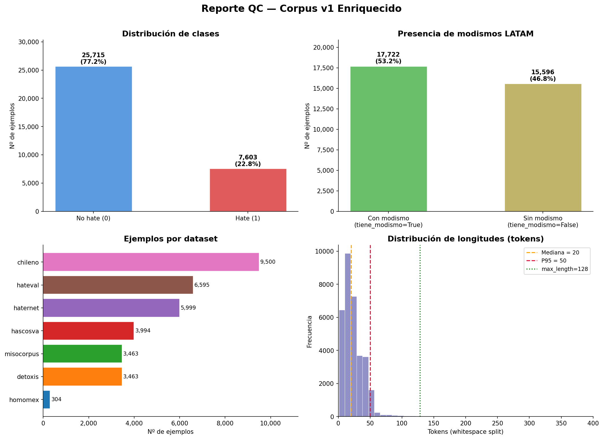

# Reporte QC Final — Corpus v1 Enriquecido

**Generado por:** `scripts/generar_reporte_qc_final.py` — Paso 1.11  
**Fecha UTC:** 2026-06-24T16:10:32Z  
**Figura:** `data/reports_qc/figuras/qc_corpus_v1_4paneles.png`

---

## 1. Tamaño total del corpus

| Métrica | Valor |
|---------|-------|
| Total filas | **33,318** |
| Hate (1) | 7,603 (22.8%) |
| No hate (0) | 25,715 (77.2%) |
| Archivo fuente | `corpus_v1_enriquecido.parquet` |

## 2. Particiones train / val / test

| Split | Filas | % del total | Hate | No hate | % Hate |
|-------|-------|-------------|------|---------|--------|
| **train** | 23,090 | 69.3% | 5,269 | 17,821 | 22.8% |
| **val** | 4,948 | 14.9% | 1,129 | 3,819 | 22.8% |
| **test** | 4,949 | 14.9% | 1,129 | 3,820 | 22.8% |

## 3. Distribución de `tiene_modismo`

| | Valor | % |
|---|---|---|
| Con modismo | 17,722 | 53.2% |
| Sin modismo | 15,596 | 46.8% |

### Cruzada: etiqueta × tiene_modismo

| | Con modismo | Sin modismo | Total |
|---|---|---|---|
| **hate** | 5,711 | 1,892 | 7,603 |
| **no_hate** | 12,011 | 13,704 | 25,715 |
| **Total** | 17,722 | 15,596 | 33,318 |

> **Observación clave (H3):** El 75.1% de las instancias *hate* contienen
> modismos LATAM vs 46.7% de las *no_hate*. Esta diferencia de
> 28.4 pp sugiere que los modismos son más frecuentes en
> el discurso de odio, lo que sustenta la relevancia de H3.

## 4. Longitud de texto (tokens)

| Métrica | Tokens | Caracteres |
|---------|--------|------------|
| Mediana | 20 | 113 |
| P95 | 50 | 283 |
| Máximo | 556 | 3270 |

> P95 = 50 tokens ≤ 128 → `max_length=128` es suficiente para BERT.

## 5. Distribución por dataset

| Dataset | Total | Hate | No hate | % Hate |
|---------|-------|------|---------|--------|
| chileno | 9,500 | 599 | 8,901 | 6.3% |
| detoxis | 3,463 | 338 | 3,125 | 9.8% |
| hascosva | 3,994 | 554 | 3,440 | 13.9% |
| haternet | 5,999 | 1,567 | 4,432 | 26.1% |
| hateval | 6,595 | 2,735 | 3,860 | 41.5% |
| homomex | 304 | 304 | 0 | 100.0% |
| misocorpus | 3,463 | 1,506 | 1,957 | 43.5% |

## 6. Duplicados

| Nivel | Duplicados |
|-------|------------|
| Exactos (texto idéntico) | 217 |
| Normalizados | 341 |
| **Eliminados en split.py** | **331** (exactos + normalizados netos) |

> Los duplicados se eliminaron en el Paso 1.9 (`src/data/split.py`) antes del particionado.
> Los splits train/val/test están libres de data leakage (0 solapamientos verificados).

## 7. Aserciones de calidad

| Aserción | Resultado |
|----------|-----------|
| IDs únicos | ✅ OK |
| Textos no nulos | ✅ OK |
| Textos ≥ 3 tokens | ⚠️ 141 casos (0.4%) — dentro del umbral aceptable |
| Etiquetas ∈ {0,1} | ✅ OK |
| `tiene_modismo` dtype == bool | ✅ OK |
| Proporción hate ∈ [5%,60%] | ✅ OK (22.8%) |
| Cobertura modismos ≥ 15% | ✅ OK (53.2%) |
| Data leakage train↔val | ✅ 0 solapamientos |
| Data leakage train↔test | ✅ 0 solapamientos |
| Data leakage val↔test | ✅ 0 solapamientos |

## 8. Figura generada

---

*Reporte generado automáticamente por `scripts/generar_reporte_qc_final.py` — Paso 1.11 del pipeline de datos.*