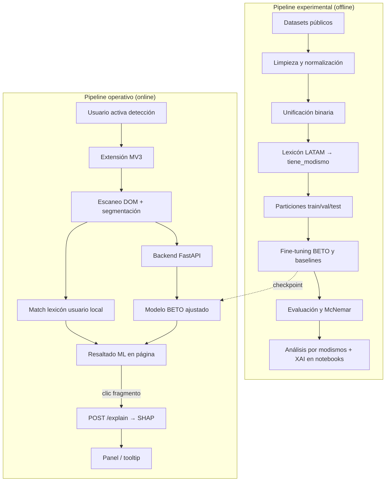
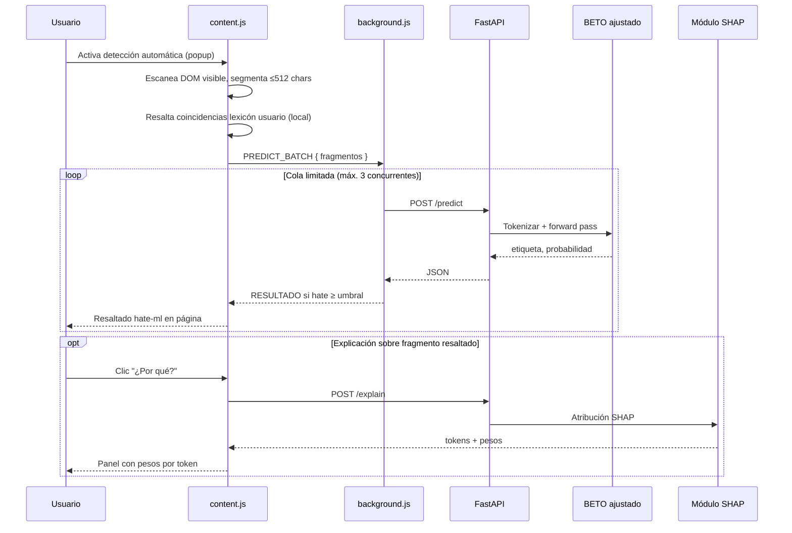
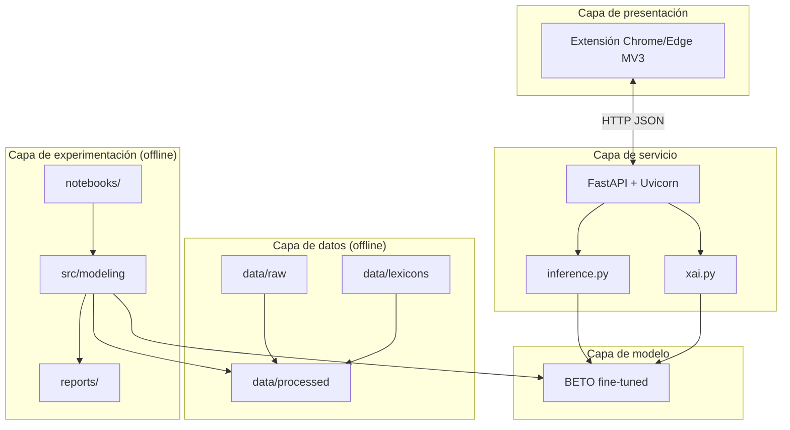
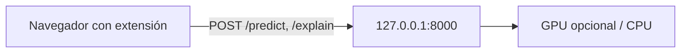
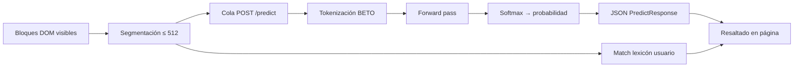

# Modelo de análisis, datos, arquitectura y diseño del sistema

**Proyecto de tesis:** Detección de discurso de odio en español con BETO ajustado, análisis por modismos latinoamericanos e Inteligencia Artificial Explicable (XAI), integrado en una extensión de navegador.

**Documento de referencia:** `guia.md`  
**Estado del documento:** diseño y avance parcial (sin resultados experimentales numéricos).

---

## Resumen

El sistema combina un **pipeline experimental offline** (construcción del corpus, entrenamiento, evaluación y validación de hipótesis) con un **pipeline operativo online** (detección automática en navegador, inferencia BETO y explicación bajo demanda). El núcleo analítico es un clasificador binario basado en **BETO** (`dccuchile/bert-base-spanish-wwm-cased`) con fine-tuning sobre un corpus unificado en español, enriquecido con un lexicón de modismos LATAM para soportar la hipótesis H3.

La extensión añade una **capa local personalizable**: el usuario gestiona su propia lista de palabras de odio (alertas instantáneas en el DOM), independiente del lexicón de investigación y del modelo ML.

---

# 1. Modelo de análisis del sistema

## 1.1 Objetivo y alcance analítico

El modelo de análisis describe **qué transformaciones y decisiones** realiza el sistema sobre el texto, desde la recolección de datos hasta la predicción explicable en tiempo de ejecución. No es un modelo de negocio ni un sistema de gestión de usuarios: es un **sistema de clasificación de texto** con componentes de investigación (comparación de modelos, significancia estadística, segmentación por modismos) y un **demostrativo** de despliegue local (API + extensión).

| Hipótesis | Contenido analítico | Evidencia prevista (según `guia.md`) |
|-----------|---------------------|--------------------------------------|
| **H1** | BETO ajustado supera a BETO base | F1, IC bootstrap, McNemar (Fase 3) |
| **H2** | BETO ajustado supera mBERT y XLM-R | Tabla comparativa + McNemar (Fase 3) |
| **H3** | Mejor desempeño en textos con modismos | Métricas por subconjunto + XAI (Fase 4) |

Los objetivos específicos OE1–OE3 del plan de tesis se materializan en las fases de evaluación y análisis por modismos descritas en la guía.

## 1.2 Flujo general del sistema

El sistema opera en dos modos complementarios que comparten el mismo esquema de etiquetas `{0: no_hate, 1: hate}` y la misma convención de preprocesamiento, pero difieren en **cuándo** y **dónde** se ejecutan los procesos.



## 1.3 Interacción entre componentes

La guía define tres módulos analíticos que se relacionan de la siguiente manera:

| Módulo | Rol en el análisis | Salidas que alimentan al resto |
|--------|-------------------|--------------------------------|
| **Datos** | Integrar fuentes heterogéneas, homogeneizar etiquetas, marcar modismos | `train.csv`, `val.csv`, `test.csv`, lexicón |
| **Modelado** | Entrenar, comparar y evaluar modelos con protocolo reproducible | Checkpoints, tablas en `reports/`, predicciones sobre test |
| **Aplicación** | Detección automática en página, lexicón usuario en navegador, inferencia BETO y XAI | Resaltados DOM, `chrome.storage.local`, JSON de `/predict` y `/explain` |

El módulo de aplicación **depende** del módulo de modelado (checkpoint entrenado), pero **no participa** en el entrenamiento ni en la evaluación del test set. El módulo de datos **precede** a todo el modelado y su test set permanece congelado desde la partición inicial.

## 1.4 Pipeline experimental (offline)

Secuencia alineada con la Fase 1–4 de `guia.md`:

```mermaid
flowchart LR
    A[Recolección RF1] --> B[Preprocesamiento RF2]
    B --> C[Mapeo etiquetas RF3]
    C --> D[Detección modismos RF4]
    D --> E[Split estratificado]
    E --> F[Fine-tuning BETO RF5]
    F --> G[Baselines mBERT/XLM-R RF6]
    G --> H[Métricas RF7 + bootstrap]
    H --> I[McNemar RF8]
    I --> J[Subconjuntos con/sin modismo RF9]
    J --> K[Análisis cualitativo + SHAP RF11]
```



**Etapas funcionales:**

1. **Recolección e integración (RF1):** combinar al menos tres fuentes en español. En el estado actual del proyecto se dispone de **HatEval**, **DETOXIS**, un **dataset chileno** (repositorio Datasets-for-Hate-Speech-Detection) y **HaterNet**. **MEX-A3T** no está disponible (acceso privado); se documenta como limitación, no como componente activo del corpus.

2. **Preprocesamiento (RF2):** normalización de URLs, menciones, hashtags y emojis; conservación de mayúsculas (BETO `cased`); eliminación de duplicados y textos vacíos; sin stemming ni eliminación de stopwords.

3. **Unificación de etiquetas (RF3):** mapeo documentado por dataset hacia `{0, 1}`. Ejemplo orientativo de la guía: HatEval `HS`, MEX-A3T `aggressive`, DETOXIS por umbral de toxicidad (ajustar según esquema real de cada fuente al integrar).

4. **Enriquecimiento con modismos (RF4):** cruce token a token contra `data/lexicons/modismos_latam.csv`; generación de `tiene_modismo`. Validación manual recomendada sobre muestras.

5. **Particiones:** división estratificada 70 % / 15 % / 15 % (train, val, test) con semilla fija; el conjunto de test no se usa para decisiones de modelo.

6. **Entrenamiento (RF5–RF6):** fine-tuning de BETO; entrenamiento equivalente de mBERT y XLM-R con mismas particiones y semillas (tres semillas: 42, 123, 2024). Comparación con BETO base según definición explícita en la tesis (guía, paso 2.5).

7. **Evaluación (RF7–RF9):** Precision, Recall, F1 (clase hate y macro), matriz de confusión, intervalos de confianza por bootstrap, test de McNemar entre modelos pareados, métricas en subconjuntos `tiene_modismo == True` vs `False`.

8. **XAI en experimentación (RF11):** atribución SHAP sobre instancias del test para vincular tokens de modismo con la predicción (soporte narrativo de H3).

## 1.5 Pipeline operativo (online)

Flujo principal: **detección automática** (opt-in). Complemento: análisis de un fragmento seleccionado manualmente.



**Dos capas de detección en la extensión:**

| Capa | Fuente | Cuándo | Red |
|------|--------|--------|-----|
| **Lexicón usuario** | `chrome.storage.local` (`palabrasUsuario`) | Siempre que la detección está activa | No |
| **Modelo BETO** | Checkpoint vía API | Fragmentos nuevos del DOM | Sí (localhost) |

**Restricciones de análisis en tiempo real:**

- Entrada máxima: 512 caracteres por petición.
- Detección automática **desactivada por defecto**; el usuario la habilita explícitamente (privacidad).
- Debounce del escaneo (~500 ms), tope de fragmentos por página y cola de inferencia en `background.js`.
- El lexicón personal **no se envía** al backend; solo se procesa en el cliente.
- El backend carga el modelo una vez al inicio (singleton); objetivo P95 &lt; 1.5 s en CPU local por fragmento.

## 1.6 Procesamiento NLP (análisis funcional)

| Etapa | Entrada | Proceso | Salida |
|-------|---------|---------|--------|
| Normalización | Texto crudo de red social | Regex + `emoji.demojize`; placeholders `URL`, `USUARIO` | Texto limpio en tabla canónica |
| Tokenización | Campo `texto` | `AutoTokenizer` BETO; `truncation=True`; `max_length` 128 (o 256 según longitud del corpus) | `input_ids`, `attention_mask` |
| Clasificación | Tensores | `AutoModelForSequenceClassification` (2 clases) | Probabilidad clase hate |
| Explicabilidad | Misma instancia | SHAP con masker de texto o integrated gradients | Lista de tokens con peso por instancia |

**Decisiones de diseño NLP relevantes:**

- No aplicar `lower()` si se usa BETO cased.
- No lematizar ni eliminar stopwords: el contexto completo es entrada del Transformer.
- Pesos por clase o estrategia documentada para desbalance (guía, paso 1.7).
- Early stopping y selección del checkpoint por F1 en validación.

## 1.7 Trazabilidad: fases, requerimientos e hipótesis

| Fase (`guia.md`) | Actividad principal | RF | Hipótesis |
|------------------|---------------------|-----|-----------|
| 1 — Datos | Corpus + lexicón + splits | RF1–RF4 | — |
| 2 — Modelado | Fine-tuning y baselines | RF5–RF6 | — |
| 3 — Evaluación | Métricas, bootstrap, McNemar | RF7–RF8 | H1, H2 |
| 4 — Modismos | Subconjuntos y análisis | RF9 | H3 |
| 5 — XAI | SHAP estandarizado | RF11 | H3 (evidencia cualitativa) |
| 6–7 — Aplicación | API y extensión automática + lexicón usuario | RF10, RF12–RF14 | — (demostración) |

---

# 2. Modelo de datos (versión mínima)

El proyecto **no** contempla una base de datos relacional central. La persistencia es **basada en archivos** y contratos de API; cualquier registro adicional (logs, predicciones puntuales, feedback) es opcional y acotado al ámbito demostrativo.

## 2.1 Tabla canónica del corpus

Tras la unificación (guía, paso 1.3), cada ejemplo del corpus se representa así:

| Columna | Tipo | Descripción |
|---------|------|-------------|
| `id` | string | Identificador único `<dataset>_<n>` |
| `texto` | string | Texto tras limpieza |
| `etiqueta` | int | `0` = no_hate, `1` = hate |
| `dataset` | string | Origen: `hateval`, `detoxis`, `chileno`, `haternet`, etc. |
| `tiene_modismo` | bool | `True` si algún token coincide con el lexicón |
| `pais` | string | Opcional: `CL`, `ES`, `MX`, … |

**Ubicación:** `data/processed/train.csv`, `val.csv`, `test.csv` (en diseño; particiones pendientes de generación).

## 2.2 Lexicón de modismos LATAM

| Columna | Tipo | Descripción |
|---------|------|-------------|
| `termino` | string | Forma en minúsculas para matching |
| `pais` | string | País o región asociada |
| `fuente` | string | Referencia citada (p. ej. ASALE, literatura) |
| `tipo` | string | coloquial, intensificador, insulto regional, etc. |

**Ubicación:** `data/lexicons/modismos_latam.csv`  
**Criterio de aceptación (RF4):** ≥ 500 términos con fuente documentada.

## 2.3 Datasets de origen (estado actual)

| Dataset | Estado | Uso previsto |
|---------|--------|--------------|
| HatEval | Disponible | Hate speech Twitter ES; campo `HS` |
| DETOXIS | Disponible | Toxicidad en comentarios; mapeo por nivel |
| Dataset chileno | Disponible | Variedad dialectal LATAM |
| HaterNet | Disponible | Hate speech Twitter ES |
| MEX-A3T | No disponible | Excluido por acceso privado; limitación documentada |

Los archivos crudos residen bajo `data/raw/<nombre_dataset>/`; las versiones limpiadas intermedias en `data/interim/`.

## 2.4 Artefactos de modelado y reportes

| Artefacto | Ubicación | Contenido |
|-----------|-----------|-----------|
| Checkpoints | `models/beto_finetuned/`, baselines | Pesos del Transformer (no versionados en git) |
| Reportes | `reports/` | Tablas, gráficos, matrices de confusión, salidas McNemar |
| Notebooks | `notebooks/01` … `07` | Trazabilidad del pipeline experimental |

## 2.5 Contratos de la API (persistencia lógica en memoria)

Esquemas previstos en FastAPI (`guia.md`, Fase 6):

**Entrada — predicción y explicación:**

```python
class PredictRequest(BaseModel):
    texto: str  # min_length=1, max_length=512
```

**Salida — predicción:**

```python
class PredictResponse(BaseModel):
    etiqueta: str       # "hate" | "no_hate"
    probabilidad: float
    modelo: str         # identificador del checkpoint cargado
```

**Salida — explicación (RF11):**

```json
{
  "etiqueta": "hate",
  "probabilidad": 0.93,
  "tokens": ["pinche", "USUARIO", "te", "odio"],
  "pesos": [0.42, -0.05, 0.10, 0.55]
}
```

Estos contratos no implican almacenamiento obligatorio en disco; la respuesta es **efímera** por petición.

## 2.6 Lexicón de alerta del usuario (extensión, RF13)

Persistencia en el navegador vía `chrome.storage.local`. **No** forma parte del corpus de entrenamiento.

| Clave | Tipo | Descripción |
|-------|------|-------------|
| `palabrasUsuario` | `string[]` | Términos agregados o quitados por el usuario |
| `deteccionActiva` | `boolean` | Detección automática on/off (default `false`) |
| `umbralMl` | `number` | Umbral de probabilidad para resaltado ML (default `0.7`) |

Operaciones en `options.html`: agregar, quitar, listar, restaurar semilla por defecto, exportar/importar JSON (opcional).

**Separación conceptual obligatoria:**

| Lexicón | Ubicación | Rol |
|---------|-----------|-----|
| Modismos LATAM (investigación) | `data/lexicons/modismos_latam.csv` | Flag `tiene_modismo`, H3, RF4 |
| Palabras de odio (usuario) | `chrome.storage.local` | Alertas locales configurables, RF13 |

## 2.7 Persistencia mínima opcional (backend, demostrativo)

Solo si se requiere trazabilidad local durante pruebas; **no** es núcleo de la tesis:

| Tipo | Campos sugeridos | Propósito |
|------|------------------|-----------|
| Log de inferencia | timestamp, longitud_texto, etiqueta, latencia_ms | Depuración y RF de rendimiento |
| Predicción puntual | id_fragmento, etiqueta, probabilidad (sin texto completo si se prioriza privacidad) | Auditoría local |

Sin autenticación ni gestión de usuarios en servidor.

---

# 3. Arquitectura del sistema

## 3.1 Vista lógica en capas



## 3.2 Componentes y tecnologías

| Componente | Tecnología | Responsabilidad |
|------------|------------|-----------------|
| Extensión | Manifest V3, JS vanilla | Escaneo DOM, lexicón local, cola predict, popup, options |
| Backend | FastAPI, Pydantic, Uvicorn | Endpoints, CORS, carga singleton del modelo |
| Modelo | `transformers`, `torch`, BETO | Clasificación binaria |
| XAI | `shap` o `transformers-interpret` | Atribución por token |
| Experimentación | Jupyter, `pandas`, `scikit-learn`, `statsmodels` | Pipeline offline y McNemar |

## 3.3 Arquitectura de despliegue local



- **Entrenamiento:** Colab, Kaggle o PC con CUDA (fuera del flujo de la extensión).
- **Inferencia:** máquina local del investigador; ámbito demostrativo, no productivo.

## 3.4 Flujo de datos (inferencia)



Para `/explain`, el mismo texto tokenizado alimenta el explainer SHAP antes de devolver `tokens` y `pesos`.

## 3.5 Modelos en el contexto arquitectónico

| Modelo | Rol arquitectónico |
|--------|-------------------|
| BETO ajustado | Modelo de producción en API y extensión |
| BETO base | Baseline experimental (definición explícita en tesis) |
| mBERT, XLM-R | Baselines offline; mismas particiones |
| Checkpoints | Artefacto versionado localmente, no en repositorio git |

---

# 4. Diseño del sistema

## 4.1 Responsabilidades por módulo

| Ruta / componente | Responsabilidad | Acoplamiento |
|-------------------|-----------------|--------------|
| `data/raw`, `data/interim`, `data/processed` | Almacenar corpus en etapas | Bajo: solo archivos |
| `data/lexicons/` | Lexicón de modismos | Usado por scripts y notebooks |
| `src/data/` | Scripts de limpieza y unificación | Produce `processed/` |
| `src/modeling/` | Entrenamiento, métricas, McNemar | Lee `processed/`, escribe `models/` y `reports/` |
| `src/xai/` | Explicaciones reutilizables | Usado por API y notebooks |
| `src/api/` | Servicio REST | Depende de un checkpoint |
| `extension/` | Cliente MV3: `content.js`, `background.js`, `lexicon.js`, popup, options | Storage local + API; sin acceso al corpus |
| `notebooks/` | Exploración y documentación de decisiones | Orquestan fases 1–7 |

## 4.2 Comunicación entre componentes

| Origen | Destino | Mecanismo | Datos |
|--------|---------|-----------|-------|
| Scripts de datos | Disco | CSV / Parquet | Tabla canónica |
| Modelado | Disco | Pickle / HF format | Checkpoints |
| Extensión (content) | Extensión (background) | `chrome.runtime.sendMessage` | Fragmentos `PREDICT_BATCH` |
| Extensión (background) | API | HTTP POST JSON | `texto` |
| Extensión | Storage | `chrome.storage.local` | `palabrasUsuario`, configuración |
| API | Extensión | HTTP 200 JSON | etiqueta, probabilidad, tokens |
| Notebooks | Scripts | Import o %run | Reproducibilidad |

No hay cola de mensajes ni bus de eventos: diseño deliberadamente simple para reproducibilidad en tesis.

## 4.3 Modularidad y separación offline / online

- **Offline:** todas las decisiones que afectan la validez científica (mapeo de etiquetas, splits, hiperparámetros, elección de checkpoint).
- **Online:** solo inferencia y XAI sobre el checkpoint ya seleccionado; sin reentrenamiento ni acceso al test set.

Esta separación evita *data leakage*. La extensión es cliente delgado respecto al entrenamiento, pero **activa en presentación**: escaneo, resaltado dual (lexicón + ML) y configuración en `options.html`.

## 4.4 Justificación arquitectónica

1. **Rigor experimental:** el peso de la tesis está en Fases 1–4 (datos, modelado, evaluación, modismos), no en la UI.
2. **Reproducibilidad:** semillas fijas, `requirements.txt`, estructura de carpetas documentada.
3. **Alineación con hipótesis:** el flag `tiene_modismo` y el lexicón son ciudadanos de primera clase en el modelo de datos y de análisis, no un post-proceso ornamental.
4. **XAI obligatoria por diseño:** la justificación metodológica de la tesis exige materializar SHAP (guía, Fase 5).
5. **Ámbito demostrativo:** API y extensión prueban despliegue local con valor para el usuario (detección automática + personalización), sin multiusuario ni backend de cuentas.
6. **Personalización sin contaminar el experimento:** el lexicón del usuario no altera el checkpoint BETO ni el corpus; documentar la distinción en la defensa.

## 4.5 Estado actual del proyecto

| Elemento | Estado |
|----------|--------|
| Recolección HatEval, DETOXIS, chileno, HaterNet | **En curso / disponible** (`data-resumen.txt`) |
| MEX-A3T | **No disponible** (limitación documentada) |
| Corpus unificado y particiones | **En diseño** |
| Lexicón ≥ 500 términos | **En diseño** |
| Fine-tuning BETO y baselines | **Pendiente** |
| API FastAPI y extensión MV3 (detección automática + options) | **Pendiente** |
| Métricas y pruebas estadísticas | **Pendiente** (sin resultados en este documento) |

## 4.6 Próximos pasos inmediatos

1. Completar notebook o script de **unificación** con tabla de mapeo por dataset (RF3).
2. Construir y validar **lexicón** y columna `tiene_modismo` (RF4).
3. Generar **train/val/test** estratificados y congelar test (RF1, paso 1.6).
4. Iniciar **fine-tuning** BETO con una semilla (RF5) antes de las tres semillas y baselines.
5. Prototipar extensión: toggle detección, `options.html` para lexicón usuario, escaneo DOM con cola en `background.js` (RF12–RF13).

---

## Referencias internas

- `guia.md` — requerimientos, fases, hiperparámetros y criterios de éxito.
- `data-resumen.txt` — inventario de datasets y campos por fuente.
- `prompt-modelo-de-analisis.md` — especificación para actualizar este documento.

---

*Documento generado como avance de tesis. No incluye resultados experimentales; las métricas se reportarán tras la Fase 3 de implementación.*
